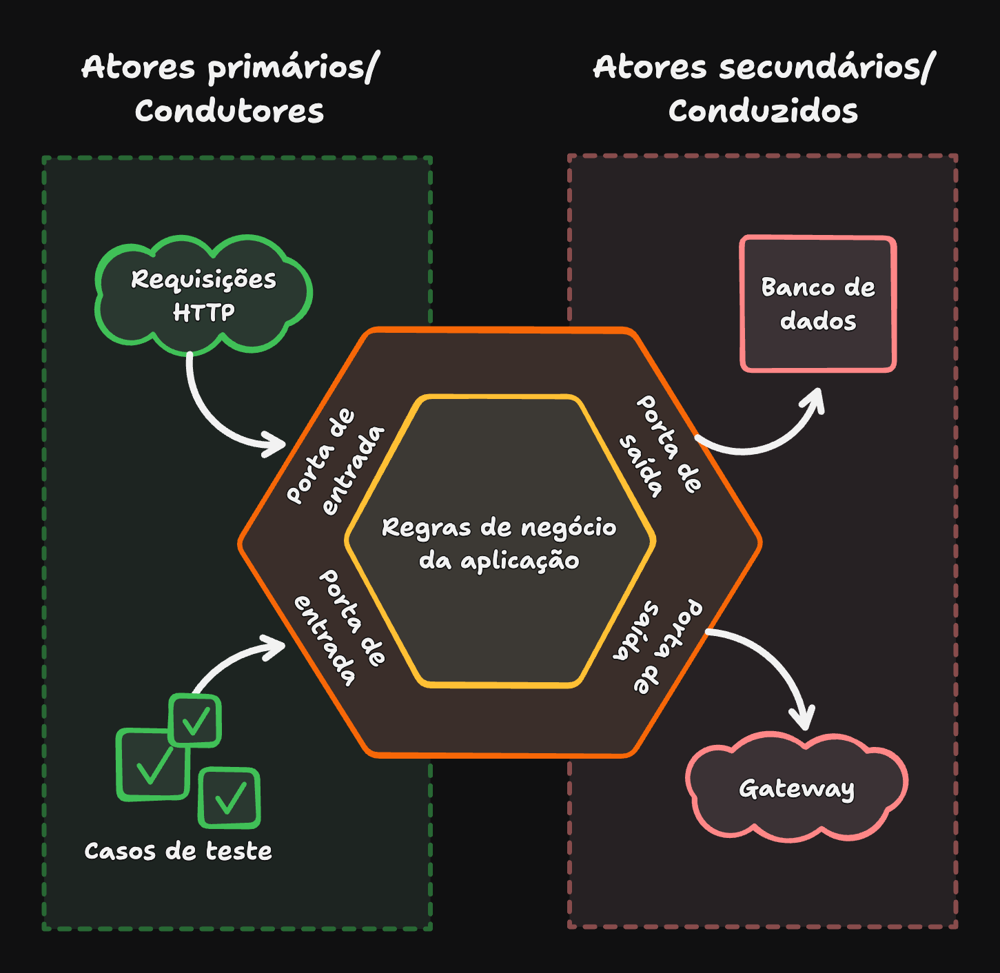
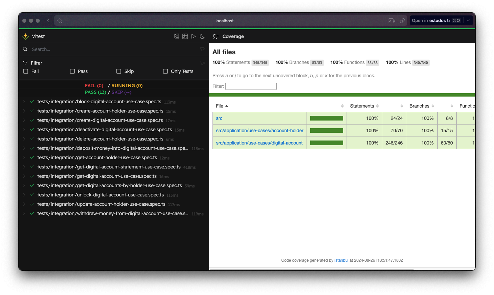

<div align="center">
  <h1>Digital Account API</h1>
  <p>API para gerenciamento de Contas Digitais</p>
  <hr>
  <a>home</a> • <a href="backlog.md">backlog</a>
  <hr>
</div>

### Como usar?

Faça o clone do projeto e siga o passo a passo abaixo

```sh
git clone https://github.com/marcusviniciusfa/digital-account-api.git
```

#### Passo a passo

```sh
# passo 1: instale as dependências
npm install

# passo 2: execute a migração para criar as tabelas com os relacionamentos no banco de dados
# `o prisma migrate dev` executa o `prisma generate` para sincronizar o branco de dados com o schema
npx prisma migrate dev

# passo 3: gere o bundle contendo os arquivos que serão executados pelo servidor no container
npm run build

# passo 4: crie e inicialize os containers com o servidor e o banco de dados
DB_HOST=database docker compose up --build

# passo 5: use a interface gráfica do prisma para visualizar os dados
npm run prisma:studio
```

Com o projeto em execução, interaja com a API através da [**documentação**](https://documenter.getpostman.com/view/37337464/2sAXjGcZA7) Postman

### Estrutura do projeto

O projeto foi estruturado com a Arquitetura Hexagonal. Esta arquitetura, ou design de código, foi pensada para segregar responsabilidades e principalmente isolar a camada de aplicação (regras de negócio independentes) dos agentes externos: Banco de dados, APIs, Requisições HTTP, Sistemas de Filas, etc. É um design simples, porém muito poderoso. Vale ressaltar que este padrão de design de código não opina sobre o domínio da aplicação (que possui regras de negócio mais independentes), diferente da Arquitetura Limpa, por exemplo, onde existe o conceito de entidade.



#### Diretórios

Os diretórios são apenas para melhorar a visualização/organização da estrutura.

```sh
src
├── application
│   └── use-cases
│       ├── account-holder
│       └── digital-account
├── helpers
├── infra
│   ├── database
│   │   ├── mappers
│   │   └── repositories
│   └── http
│       └── routes
└── ports
```

O relacionamentos e responsabilidades definem o design de código adotado.

- `use-cases` - Os casos de uso abstraem e isolam as regras de negócio da aplicação do meio externo. Eles atuam como portas para que os atores primários (meio externo condutor) interajam com a aplicação invocando seu contrato da entrada. Além disso, os casos de uso também expõem uma expectativa de saída. No nosso caso, tanto os testes quanto as rotas HTTP com Express.js são os condutores da aplicação. Ambos interagem com os casos de uso por meio de uma entrada e um retorno padrão.
- `repositories` - Os repositórios implementam interfaces (portas) que são utilizadas pelos casos de uso para conduzir a persistência dos dados. Os casos de uso dependem apenas de interfaces, desta forma, os repositórios podem se adaptar aos atores secundários (meio externo conduzido) para implementar a tecnologia escolhida para trabalhar com os dados, sem que os casos de uso se "preocupem" com isso, reduzindo o acoplamento, possibilitando a criação de testes.
- `ports` - interfaces utilizadas pelos casos de uso para entrada e saída de dados da aplicação

### Testes

Os casos de uso estão com 100% de cobertura de código, isso quer dizer que todas as linhas dos casos de uso estão sendo avaliadas pelos casos de testes.

```sh
# passo 1: instale as dependências
npm install

# passo 2: execute os testes de integração e veja os resultados na interface gráfica do Vitest
npm run test:ui --dir tests/integration
```


